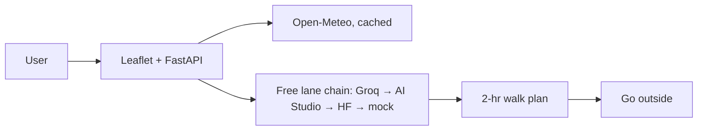

# Foliage Walk Planner — DEV draft (do not publish yet)

*This is a submission for the [Hacktoberfest Open-Source AI Challenge Week 1: Touch Grass](https://dev.to/challenges/hacktoberfest-week1-2026-10-05)*

TL;DR — 1 input → 1 foliage walk + map in under a minute, then go outside. Open-weight GPT-OSS 20B via Groq free tier. Live: https://foliage-walk-planner.onrender.com | Repo: https://github.com/ramantiw45/Hacktoberfest/tree/main/week-01-touch-grass

## What I Built
A walk planner for people who keep meaning to get outside and don't. Enter a place and a time budget, get the best window, a loop idea, one nature cue and a packing line, plus a live map pin — then close the tab and go.

I built it because planning the walk is exactly where plans die. Weather apps want a full day of attention, trail sites want a login, and foliage trackers are US-only. I wanted the whole decision to fit in one minute, because at one minute it competes with nothing. On my own test walk I spent about a minute on the screen and one to two hours outside — roughly sixty to one. The screen being the shortest part is a design target here, not a slogan.

## Demo
Live: https://foliage-walk-planner.onrender.com — try Virar (19.45510, 72.82513) or Prospect Park (40.660, -73.969). Cold start takes ~30-60 s on Render free tier.


Verbatim output for `Virar`:
1. 10:00-12:00
2. 2-3 km loop around Virar Lake promenade (no car needed)
3. First golden leaves on the banyan trees
4. Water, a light jacket, and a phone charger
5. It's a real nature escape that recharges your brain more than scrolling.

## Field test — I took it to Virar
One tap, then I went outside for one to two hours. Screenshots from the walk:


**One minute on screen. One to two hours outside.** That ratio is the entire point of the theme.

What worked: the plan named a destination I would not have picked myself — the lake promenade — and the "no car needed" line meant I walked instead of driving. The packing line (water, light jacket) was correct.

What failed, honestly:

- **Weather never rendered on the deployed app.** Render's free tier shares one outbound IP across many instances, and Open-Meteo rate-limits that IP, so the forecast silently fell back to generic advice. The fix (caching plus one polite retry) landed after this test; the failure is still visible in the screenshots, which is why I'm showing it.
- **"First golden leaves on the banyan trees" is a New England line, not a Maharashtra one.** The prompt is written for autumn foliage. In mid-October Virar the banyans are still deep green, so I ignored the cue entirely. Testing a fall-foliage tool in a place with no fall foliage is my mistake, and it is the clearest lesson of the build.
- The suggested window was wrong by hours: it said 10:00-12:00, I went early morning because the midday haze in my own photos is the honest reason to go earlier. The app could not tell me that, because the weather call was the part that failed.

Would I use it again next weekend? Yes — for the destination, not for the foliage talk. "Here is a walk you can start in 60 seconds" is the value. If the weather call worked, it would have told me early morning beats midday, which is exactly what I did.

## Code
https://github.com/ramantiw45/Hacktoberfest/tree/main/week-01-touch-grass — public, MIT LICENSE, `pip install -r requirements.txt` + `uvicorn app:app`.

## How I Built It
- Model: `openai/gpt-oss-20b` (OpenAI's open-weight model, Apache-2.0, https://huggingface.co/openai/gpt-oss-20b), served via Groq free tier, OpenAI-compatible endpoint. Swap with one env var (`GROQ_MODEL`, or `GEMINI_MODEL` for Gemma 3, or `MODEL_ID` for any HF model).
- Honest build log: started on Qwen 2.5 via Hugging Face — then HF put Inference Providers behind paid credits (402), their free lane had no chat models left, and Groq retired both Llama 3.x models to Enterprise mid-week. Because the app talks OpenAI-compatible chat + env-var model IDs, each swap was one line, zero rewrites. That portability IS the open story.
- No local GPU needed: same weights run locally later (`ollama run gpt-oss:20b`).
- Stack: FastAPI + Leaflet/OpenStreetMap (no Google key) + Open-Meteo (no key, cached 10 min). Deploy: Render free.


## Why Does Open Innovation Matter?
$0 to run, no vendor lock, swappable models by env var (proven three times in one week), hackable prompt, location data goes to a free inference lane — not a closed API that bills per token and can't be self-hosted. A closed API would have left me stranded when providers changed terms; open weights meant there was always another lane.

## Theme mapping
Touch Grass, literally: ~1 minute on a screen, 1-2 hours of hill, lake and estuary. Getting people *into the world*: the app's only job is to end its own usefulness — every output is an instruction to close the tab. *Screen is the shortest part:* sixty to one, measured on my own walk.

## Prize Categories
Best Use of Render — FastAPI hosted on Render free tier (Root Directory `week-01-touch-grass`), live URL above.

## Run it yourself
```
pip install -r requirements.txt
copy .env.example .env  # add GROQ_API_KEY from console.groq.com (free, no card)
uvicorn app:app --reload --app-dir week-01-touch-grass
# open http://127.0.0.1:8000
```
No key? App serves a mock plan + friendly lane errors, so judges can always click through.

## Credits
Open-Meteo, OpenStreetMap, Leaflet, Groq, the GPT-OSS open weights. Built with an AI coding agent. AI disclosure: some_ai.
