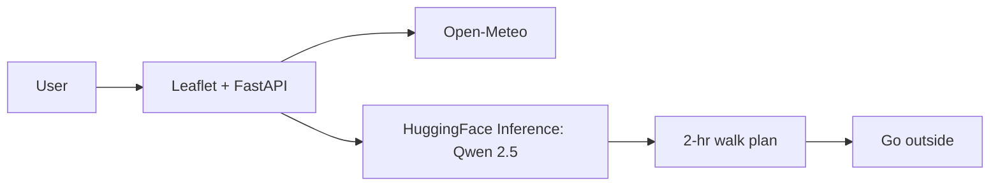

# Foliage Walk Planner — DEV draft (do not publish yet)

*This is a submission for the [Hacktoberfest Open-Source AI Challenge Week 1: Touch Grass](https://dev.to/challenges/hacktoberfest-week1-2026-10-05)*

TL;DR — 1 input → 1 foliage walk + map. Open-weight Qwen via HF Inference. Live: <render-url> | Repo: <github-url>

## What I Built
Who it's for + how it gets them outside in <1 min screen time.

## Demo
Live link + 60-sec video/GIF. Test: lat 40.66 lon -73.969.

## Code
GitHub repo link (public + LICENSE).

## How I Built It
- Model: Qwen/Qwen2.5-7B-Instruct, https://huggingface.co/Qwen/Qwen2.5-7B-Instruct, Apache-2.0. Swap via MODEL_ID to meta-llama/Meta-Llama-3.1-8B-Instruct.
- No local GPU: hosted open-weight via Hugging Face Inference API (HF_TOKEN). Same weights you could run on Ollama later (`ollama run qwen2.5`).
- Stack: FastAPI + Leaflet/OSM (no Google key) + Open-Meteo (no key). Deploy: Render free via render.yaml.
- Mermaid:


## Why Does Open Innovation Matter?
Offline/privacy/cost/swap: $0, no vendor lock, swap models with 1 env var, hackable prompt, could run locally later. Why not closed: GPT-4 API would cost + send location data to a server you don't control + can't fine-tune.

## My Agent Session
Optional: 

## Prize Categories
Best Use of Render — FastAPI hosted on Render free tier, live URL above.

## Run it yourself
```
pip install -r requirements.txt
cp .env.example .env  # add HF_TOKEN from huggingface.co/settings/tokens
uvicorn app:app --reload
# open http://127.0.0.1:8000
```
No token? App returns mock plan so judges can still test.

## Credits
Open-Meteo, OSM, Hugging Face, Qwen. AI disclosure: some_ai.
