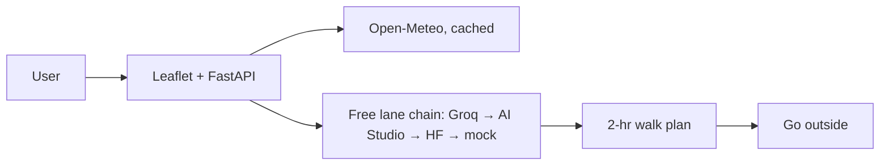

# Foliage Walk Planner — DEV draft (do not publish yet)

*This is a submission for the [Hacktoberfest Open-Source AI Challenge Week 1: Touch Grass](https://dev.to/challenges/hacktoberfest-week1-2026-10-05)*

TL;DR — 1 input → 1 foliage walk + map in under a minute, then go outside. Open-weight GPT-OSS 20B via Groq free tier. Live: https://foliage-walk-planner.onrender.com | Repo: https://github.com/ramantiw45/Hacktoberfest/tree/main/week-01-touch-grass

## What I Built
A walk planner for anyone who keeps missing peak foliage colour. Enter a place + time budget → get the best 2-hour window, a 2–3 km loop idea, one foliage cue, and a packing line — plus a live map pin. Screen time under a minute; the walk is the product. (TODO: your 1-line story — who did you build this for?)

## Demo
Live: https://foliage-walk-planner.onrender.com — try lat 40.660 lon -73.969 (Prospect Park). Cold start takes ~30–60 s on Render free tier.
TODO: add 60-sec video/GIF + screenshot of a real plan.

## Code
https://github.com/ramantiw45/Hacktoberfest/tree/main/week-01-touch-grass — public, MIT LICENSE, `pip install -r requirements.txt` + `uvicorn app:app`.

## How I Built It
- Model: `openai/gpt-oss-20b` (OpenAI's open-weight model, Apache-2.0, https://huggingface.co/openai/gpt-oss-20b), served via Groq free tier, OpenAI-compatible endpoint. Swap with one env var (`GROQ_MODEL`, or `GEMINI_MODEL` for Gemma 3, or `MODEL_ID` for any HF model).
- Honest build log: started on Qwen 2.5 via Hugging Face — then HF put Inference Providers behind paid credits (402), their free lane had no chat models left, and Groq retired both Llama 3.x models to Enterprise mid-week. Because the app talks OpenAI-compatible chat + env-var model IDs, each swap was one line, zero rewrites. That portability IS the open story.
- No local GPU needed: same weights run locally later (`ollama run gpt-oss:20b`).
- Stack: FastAPI + Leaflet/OpenStreetMap (no Google key) + Open-Meteo (no key, cached 10 min). Deploy: Render free.


## Why Does Open Innovation Matter?
$0 to run, no vendor lock, swappable models by env var (proven three times in one week), hackable prompt, location data goes to a free inference lane — not a closed API that bills per token and can't be self-hosted. A closed API would have left me stranded when providers changed terms; open weights meant there was always another lane.

## Field test (TODO: fill from field-test.md)
Took it outside: place, weather shown vs actual, photo, what worked, what failed honestly, screen time vs outside time.

## Prize Categories
Best Use of Render — FastAPI hosted on Render free tier (Root Directory `week-01-touch-grass`), live URL above.

## Run it yourself
```
pip install -r requirements.txt
copy .env.example .env  # add GROQ_API_KEY from console.groq.com (free, no card)
uvicorn app:app --reload --app-dir week-01-touch-grass
# open http://127.0.0.1:8000
```
No key? App serves a mock plan + friendly lane errors, so judges can always click through.

## Credits
Open-Meteo, OpenStreetMap, Leaflet, Groq, the GPT-OSS open weights. Built with an AI coding agent. AI disclosure: some_ai.
